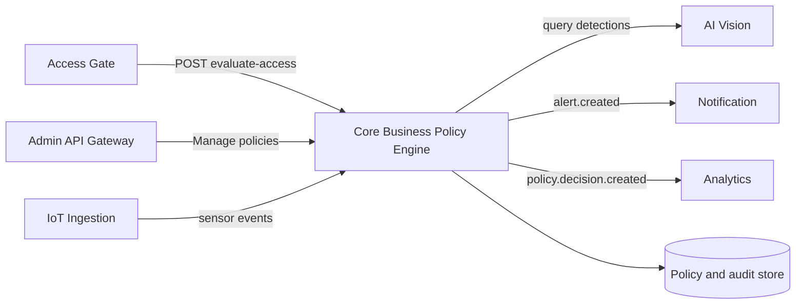

# Service Boundary - Core Business

## 1. Thong tin nhom

- Ten nhom: 6A
- Lop: CNTT 17-10
- Thanh vien: Nguyen Trong Nam, Tran Quang Huy, Pham Hoang Anh
- Service phu trach: Core Business (Policy Engine)
- San pham: Smart Campus Operations Platform

## 2. Actor va consumer

- Access Gate: goi Core de kiem tra quyen ra/vao theo thoi gian thuc.
- Quan tri vien: tao, cap nhat va vo hieu hoa policy.
- Operator/Security: tra cuu quyet dinh va canh bao de audit.
- IoT Ingestion: publish sensor event cho Core danh gia policy.
- API Gateway: xac thuc va chuyen request tu ung dung quan tri.

## 3. System boundary

Core Business kiem soat:

- Policy truy cap va policy canh bao cua smart campus.
- Logic danh gia `ALLOW`/`DENY` cho yeu cau ra/vao.
- Quyet dinh policy, ma ly do, thoi han va audit trail.
- Vong doi alert duoc tao tu policy.
- Idempotency cua request danh gia policy.

Core Business chi tich hop, khong so huu:

- Du lieu the va trang thai cong cua Access Gate.
- Ket qua detect/face match cua AI Vision.
- Telemetry goc cua IoT Ingestion.
- Kenh gui email/SMS/push cua Notification.
- Kho du lieu tong hop va KPI cua Analytics.

## 4. Trach nhiem cua service

Service PHAI:

- Danh gia request truy cap theo policy dang active.
- Tra ket qua nhat quan, co `decisionId`, `reasonCode` va `policyId`.
- Luu quyet dinh de tra cuu va audit.
- Tu choi payload sai schema bang Problem Details.
- Bao ve API nghiep vu bang Bearer token; de `/health` public.
- Phat event `policy.decision.created` va `alert.created` cho downstream.

Service KHONG:

- Dieu khien phan cung cong hoac camera.
- Thuc hien nhan dien hinh anh.
- Gui notification truc tiep den nguoi dung.
- Tong hop dashboard/KPI.
- Luu secret that trong source code.

## 5. Input va output

### Input chinh

- `cardId`, `gateId`, `direction`, `occurredAt` tu Access Gate.
- Thuoc tinh chu the nhu role, card status va zone.
- Sensor/vision event tu cac service khac qua queue hoac adapter.
- Cau hinh policy tu quan tri vien.

### Output chinh

- `ALLOW` hoac `DENY` kem ma ly do co the xu ly bang may.
- `decisionId`, `policyId`, `evaluatedAt`, `expiresAt` de audit.
- Problem Details cho loi 400/401/403/404/409/422/500.
- Event bat dong bo cho Notification va Analytics.

## 6. API du kien

| Method | Endpoint | Muc dich |
|---|---|---|
| GET | `/health` | Kiem tra service va phien ban |
| POST | `/policies/evaluate-access` | Danh gia quyen ra/vao realtime |
| GET | `/policies/{policyId}` | Lay policy de debug/audit |
| POST | `/policies` | Tao policy moi |
| GET | `/decisions/{decisionId}` | Tra cuu quyet dinh da tao |
| GET | `/alerts` | Liet ke alert do policy engine tao |

## 7. Phu thuoc theo Dependency Map

| Huong | Service | Co che | Muc dich |
|---|---|---|---|
| Access Gate -> Core | Core la Provider | REST sync | Kiem tra policy ra/vao realtime |
| Core -> AI Vision | Core la Consumer | REST sync | Lay ket qua phan tich/detect |
| Core -> Access Gate | Core la Consumer | REST sync | Doc log quet the/trang thai cong khi can |
| IoT Ingestion -> Core | Core la Consumer | Queue async | Nhan sensor event moi |
| Core -> Notification | Core la Producer | Queue async | Trigger alert da kenh |
| Core -> Analytics | Core la Producer | Queue async | Feed policy decision va alert cho KPI |

## 8. So do boundary

## 9. Phi chuc nang va nguyen tac tich hop

- Target p95 cho evaluate access: duoi 300 ms trong moi truong lab.
- Access Gate fail-closed neu Core timeout hoac tra 5xx.
- Retry phai gui `Idempotency-Key` de khong tao quyet dinh trung.
- Tat ca request co `correlationId` de trace xuyen service.
- Event co `eventId`, `occurredAt`, `schemaVersion` va `correlationId`.
